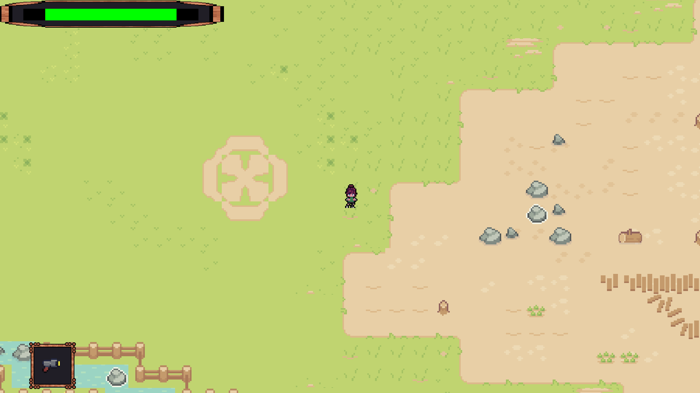

# Wave Survival - Pixel Art Top-Down Shooter

**Simple 2D top-down wave survival game**  
University project for "Introduction to Computer Science" course  
Made with **C++17** + **SFML 3.0**

  

## About the project

Small, classic-style wave survival shooter in pixel-art aesthetics. We split task for our project team. Everyone has their own branch and at the end of the week we merge all changes to main, resolve conflits etc.

**Main features:**
- Top-down 2×2 perspective
- Increasing difficulty waves of enemies
- Different enemy types (basic, fast)
- Simple player upgrades / temporary power-ups
- Save and load game
- Death screen + restart option
- Basic particle effects & hit feedback

The project was created mainly to learn:
- OOP c++
- SFML 
- Game loop & time management
- Basic collision detection
- Sprite animation
- Simple AI (pathfinding lite / direct chase)
- Resource management in SFML
- CMake + FetchContent modern workflow

## Technologies

- **C++17**
- **SFML 3.0** (graphics, window, audio)
- **nlohmann/json** (probably for saving score/config)
- CMake (modern FetchContent approach)

## How to build and run locally

### Prerequisites

- Git
- CMake ≥ 3.28
- C++17 capable compiler (MSVC 2019/2022, GCC 11+, Clang 14+)

### Build instructions (all platforms)

```bash
# 1. Clone repository
git clone https://github.com/Szafter12/PI-game
cd PI-game

# 2. Create build directory
mkdir build && cd build

# 3. Configure
cmake .. -DCMAKE_BUILD_TYPE=Release

# 4. Build
cmake --build . --config Release --parallel

# 5. The executable should appear in:
# Windows:    build/bin/Release/Game_PI.exe
# Linux/macOS: build/bin/Game_PI

```
### Windows – Visual Studio users (alternative way)

- Open folder → select CMakeLists.txt → "Open as CMake project" (VS 2022)
- Wait for configuration
- Select Game_PI as startup project
- Build & run (F5 / F7)

## Controls (default)

- Move - WASD
- Shoot - Space Button
- Aim - Mouse cursor
- Quit - P
- Menu - Esc
